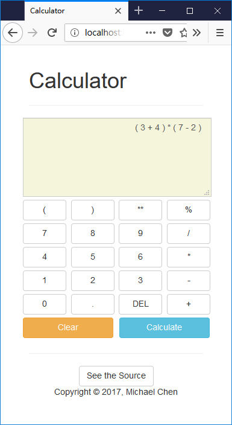

# tscalc-web

A simple web calculator.

## Intro

This web calculator utilizes [tscalc](https://github.com/cwchentw/tscalc), an elementary arithmetic interpreter, for calculation.

## Usage

Use [Git](https://git-scm.com/) to clone the repo:

```
$ git clone https://github.com/cwchentw/tscalc-web.git
```

Run the program:

```
$ cd tscalc-web
$ go run app.go
```

Visit http://localhost:8080 to access this application:



## Copyright

2017-2018, Michael Chen; MIT
